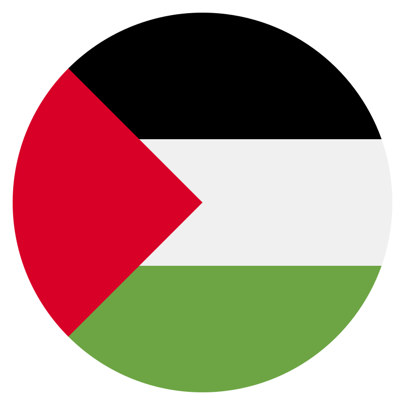

# Free Palestine App 🇵🇸

A WebView Android application displaying the Free Palestine website, built with Jetpack Compose and Material 3.

## 🌟 Features

- Modern Android app using Jetpack Compose
- Material 3 Design with Palestine theme colors
- WebView integration for seamless web content
- Automatic CI/CD with GitHub Actions
- Signed Release builds

## 📱 App Details

- **Package Name**: `com.palestine.webview`
- **Min SDK**: 24 (Android 7.0)
- **Target SDK**: 34 (Android 14)
- **Website**: https://free-palestine.flutterflow.app

## 🚀 Getting Started

### Prerequisites

- Android Studio (latest version)
- JDK 17 or higher
- Android SDK

### Building Locally

1. Clone the repository:
```bash
git clone https://github.com/mostafaalagamy/Palestine.git
cd Palestine
```

2. Open in Android Studio

3. Build the project:
```bash
./gradlew assembleDebug
```

## 🔄 CI/CD

The project includes GitHub Actions workflow that:

- Builds signed Release APK on every push
- Creates GitHub releases automatically
- Uploads APKs as artifacts

### Workflow Triggers

- Push to `main` or `master` branch
- Pull requests
- Manual dispatch

## 📦 Download

You can download the latest APK from:
- [GitHub Releases](https://github.com/mostafaalagamy/Palestine/releases)
- GitHub Actions artifacts

## 🛠️ Technology Stack

- **Language**: Kotlin
- **UI Framework**: Jetpack Compose
- **Design System**: Material 3
- **WebView**: Native Android WebView
- **Build System**: Gradle with Kotlin DSL
- **CI/CD**: GitHub Actions

## 🎨 Theme

The app uses Palestine flag colors:
- Primary: Palestine Green (#007A3D)
- Secondary: Palestine Red (#CE1126)
- Background: Adaptive to system theme

## 📄 License

This project is open source and available for the Palestine cause.

## 🤝 Contributing

Contributions are welcome! Please feel free to submit a Pull Request.

## 🇵🇸 Stand with Palestine

This app is dedicated to raising awareness about Palestine.

---

**Free Palestine** 🇵🇸


